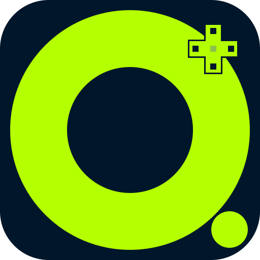

# 🌌 ODZEN — Cybernetic Gaming Platform (v1.3.0)

<p align="center">
  
</p>

<p align="center">
  <strong>Next-Generation Multi-Platform Game Discovery & Unified Desktop Launcher</strong><br>
  Powered by <strong>Rust (2024 Edition)</strong> & <strong>Avalonia C# (.NET 10)</strong>
</p>

<p align="center">
  
  
  
  
  
</p>

---

## 🌟 Key Features

- 🦀 **Unified Rust Core (`odzen-core`):** Blazing fast disk & platform scanner powered by multi-threaded Rayon parallelism with zero runtime external dependencies.
- 🎨 **4K Transparent Logo Pipeline:** SIMD-accelerated transparent canvas cropper, automatic multi-tier CDN resolver (Steam, SteamGridDB, Curated Database).
- 🎮 **13+ Game Platforms Supported:** Native discovery for Steam, Epic Games, Xbox / Microsoft Store, EA App, Riot Games, Ubisoft Connect, GOG Galaxy, Battle.net, Rockstar Games Launcher, Minecraft (Vanilla, Bedrock, CurseForge, Prism), Metin2 (Official & P-Servers), and custom local executables.
- 🎵 **Integrated Music & Media Hub:** Instant access to Spotify, YouTube Music, Apple Music, Tidal, and Deezer with user visibility toggles.
- 🌍 **8-Language Localization:** Built-in dynamic translation for English, Turkish, German, Bulgarian, Spanish, Dutch, French, and Russian.
- 🖥️ **GPU-Accelerated Glassmorphic UI:** Smooth, dark-themed responsive interface with configurable UI scaling (80% to 140%).
- 🛡️ **Zero-Crash Reliability:** Memory optimizer (`TrimMemory`), tray minimization, and isolated offline storage (`library.json` & `settings.json`).

---

## 📂 Project Architecture

```text
ODZEN_V1.3_GITHUB/
├── core/                                # 🦀 Unified Rust Core Engine (odzen-core)
│   ├── Cargo.toml                       # Rust 2024 Edition Package Manifest
│   ├── README.md                        # Core API & CLI Documentation
│   └── src/
│       ├── main.rs                      # Standalone CLI Entry Point
│       ├── lib.rs                       # Clean Library API Exports
│       ├── error.rs                     # Error Handling & Result Types
│       ├── models/                      # Game, LaunchTarget, Platform, ScanReport
│       ├── scanner/                     # 13+ Parallel Platform Scanners & Engine
│       ├── artwork/                     # 4K Logo Cropper & Multi-Tier Resolver
│       ├── launcher/                    # Native Process & Protocol Launchers
│       ├── sysinfo/                     # Hardware & System Diagnostics
│       ├── music/                       # Desktop Apps & Web Player Integrations
│       └── util/                        # Paths, Registry & VDF Parsers
│
├── ui/                                  # 🖥️ Avalonia C# (.NET 10) Desktop Client
│   ├── Odzen.Avalonia.csproj
│   ├── App.axaml / App.axaml.cs
│   ├── Program.cs
│   ├── Views/                           # MainWindow.axaml & UI Layouts
│   ├── ViewModels/                      # MainViewModel.cs (CommunityToolkit.Mvvm)
│   ├── Models/                          # GameModel.cs & AppSettings.cs
│   ├── Services/                        # Scanner, Artwork & System Services
│   └── Assets/                          # Vector Graphics & Theme Resources
│
├── assets/                              # 🎨 Logos, Icons & Platform Badges
├── docs/                                # 📚 Architecture Specs & Screenshots
└── release/                             # 📦 Pre-compiled Standalone Windows x64 Binaries
    ├── ODZEN.exe
    ├── core/
    │   └── odzen-core.exe
    └── assets/
```

---

## 🛠️ Building from Source

### Prerequisites
- [.NET 10.0 SDK](https://dotnet.microsoft.com/download)
- [Rust 1.85+ (Rust 2024 Edition)](https://rustup.rs/)

### 1. Build the Rust Core Engine
```bash
cd core
cargo build --release
```
The optimized native binary will be generated at `core/target/release/odzen-core.exe`.

### 2. Build and Run the Desktop Client
```bash
cd ui
dotnet run -c Release
```

### 3. Publish Single-File Release
```bash
cd ui
dotnet publish -c Release -r win-x64 -p:PublishSingleFile=true --self-contained false -o ../release
```

---

## 📄 License
This project is open-source software licensed under the [MIT License](LICENSE).  
Developed by **Taroxzen** ([GitHub](https://github.com/taroxzen)).
