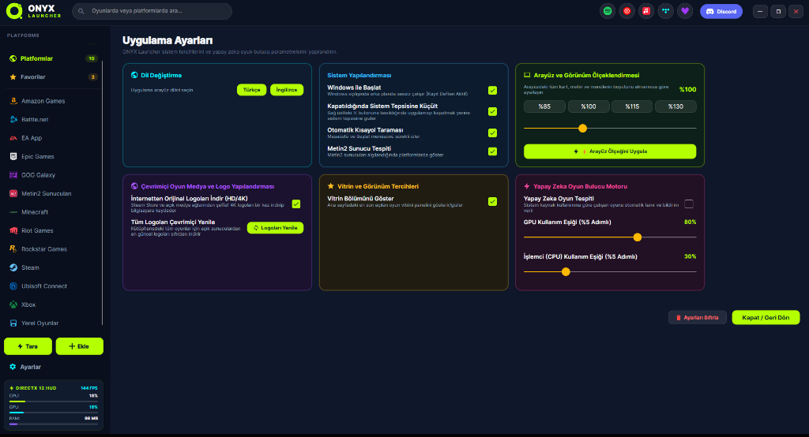
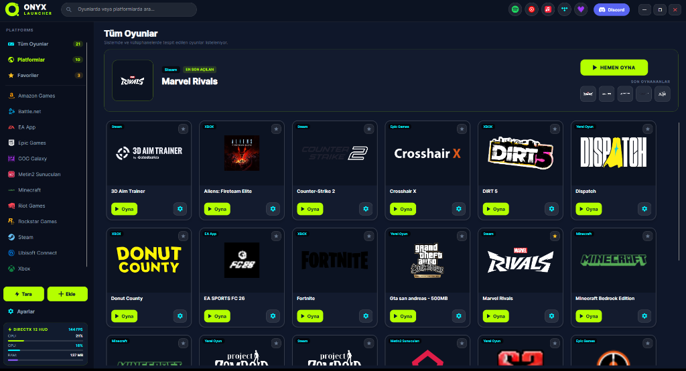
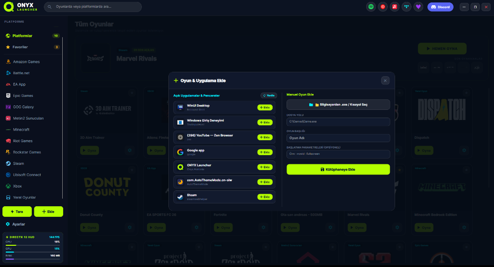

# ⚡ ONYX Launcher — Cyberpunk Game Library & Platform Hub

<div align="center">
  
  
  <br/><br/>

  [](https://github.com/taroxzen)
  [](https://github.com/taroxzen/ONYX-Launcher)
  [](https://github.com/taroxzen/ONYX-Launcher)
  [](https://github.com/taroxzen/ONYX-Launcher)
  [](https://github.com/taroxzen/ONYX-Launcher)
  [](https://github.com/taroxzen/ONYX-Launcher)
  [](LICENSE)
</div>

---

## 👨‍💻 Geliştirici / Author
Bu proje **[Taroxzen](https://github.com/taroxzen)** tarafından tasarlanmış ve geliştirilmiştir.  
GitHub Profili: 👉 **[https://github.com/taroxzen](https://github.com/taroxzen)**

---

## 🌟 ONYX Launcher Nedir? (What is ONYX?)

**ONYX Launcher**, bilgisayarınızdaki tüm oyunları (Steam, Epic Games, Riot, Ubisoft, EA, Battle.net, GOG, Xbox, Minecraft ve yerel oyunlar) tek bir çatı altında toplayan, ultra hafif (**sadece ~25 MB RAM kullanan**), donanım hızlandırmalı ve modern Cyberpunk tasarımlı yeni nesil bir oyun kütüphanesidir.

Ağır, yavaş ve yüzlerce megabayt bellek tüketen Chromium/Electron tabanlı başlatıcıların aksine; **saf C# / .NET 10 + DirectX 12 SkiaSharp** ve **Rust** tarayıcı çekirdeği ile geliştirilmiştir.

---

## 🌍 Desteklenen Diller (8 Languages Supported)

ONYX Launcher, tek tıkla anında değişen **8 farklı dili** eksiksiz destekler:

| Bayrak | Dil | Flag | Language |
| :---: | :--- | :---: | :--- |
| 🇹🇷 | **Türkçe** | 🇪🇸 | **Español** (İspanyolca) |
| 🇬🇧 | **English** (İngilizce) | 🇳🇱 | **Nederlands** (Hollandaca) |
| 🇩🇪 | **Deutsch** (Almanca) | 🇫🇷 | **Français** (Fransızca) |
| 🇧🇬 | **Български** (Bulgarca) | 🇷🇺 | **Русский** (Rusça) |

---

## 📸 Ekran Görüntüleri & Arayüz Vitrini (Screenshots)

### 1. 🎮 Ana Kütüphane & Sinematik Vitrin (Main Library View)
Tüm platformlardaki oyunlarınızı tek ekranda listeleyin, son oynananları görün ve oyunlarınızı tek tıkla başlatın.
<div align="center">
  
</div>

---

### 2. 🌐 Orijinal Platform İstemcileri Merkezi (Platform Launchers Hub)
Steam, Epic Games, Riot Client, Minecraft, Rockstar, Ubisoft, EA, Battle.net, GOG Galaxy ve Xbox PC resmi istemcilerini tek bir panelden başlatın.
<div align="center">
  
</div>

---

### 3. ➕ Çift Modlu Kolay Oyun & Uygulama Ekleme (Dual-Mode Add Game)
* **Sol Taraf:** O an arka planda açık olan pencereleri/oyunları logolarıyla listeler, tek tıkla kütüphaneye ekler.
* **Sağ Taraf:** Bilgisayarınızdan `.exe` veya masaüstü kısayollarını (`.lnk`) özel başlatma parametreleriyle eklemenizi sağlar.
<div align="center">
  
</div>

---

### 4. ⚙️ Gelişmiş Ayarlar & Kontrol Paneli (Settings Dashboard)
Arayüz ölçeklendirme (%85 - %130), 8 dil seçimi, yapay zeka oyun bulucu motoru ve şeffaf logo indirme yönetimi.
<div align="center">
  
</div>

---

## 🚀 Öne Çıkan Özellikler (Key Features)

* **🦀 Ultra Hızlı Rust Tarayıcı Motoru:** Bilgisayarınızdaki 10'dan fazla platformu milisaniyeler içinde tarar ve oyunlarınızı bulur.
* **🤖 Yapay Zeka Arka Plan Oyun Algılama:** Yeni bir oyun açtığınızda arka planda otomatik tespit eder ve kütüphanenize eklemek için Windows bildirimiyle sorar (*Evet / Hayır*).
* **⚡ İpeksi Akıcı Geçişler (Silky Smooth Transitions):** Tüm buton ve kartlarda `CubicEaseOut 250ms` yumuşak ışık ve hover geçişleri.
* **🛡️ %100 Yerel ve Gizlilik Odaklı (Zero Telemetry):** Dışarıya hiçbir kullanıcı verisi gönderilmez. Kütüphaneniz tamamen kendi bilgisayarınızda (`library.json`) saklanır.
* **🎨 3 Kademeli Logo Sistemi:** Oyunun orijinal `.exe` ikonu, Steam Store API'den yüksek çözünürlüklü şeffaf 4K logo veya kullanıcının seçtiği özel görsel.
* **📊 Donanım HUD (DirectX 12):** Sol alt köşede anlık CPU, GPU sıcaklık/kullanım ve RAM göstergesi.
* **🎵 Müzik & Medya Entegrasyonu:** Spotify, YouTube Music, Apple Music, Tidal, Deezer ve Discord için hızlı erişim butonları.

---

## 🛠️ Mimari & Kullanılan Teknolojiler (Tech Stack)

* **Arayüz (Frontend):** C# 13, .NET 10, [Avalonia UI](https://avaloniaui.net/), XAML, SkiaSharp (DirectX 11/12 Donanım Hızlandırması).
* **Arka Plan (Backend Core):** Rust (`onyx-game-scanner`), Windows Shell API, Windows Registry Provider.
* **Grafik & İkonlar:** Vektör SVG formatı.
* **Veritabanı & Önbellek:** Yerel JSON (`library.json`).

---

## 📦 Kurulum ve Çalıştırma (Quick Start)

### Yöntem 1: Hazır Taşınabilir Paketi Çalıştırma (En Kolay)
1. [`Releases`](https://github.com/taroxzen/ONYX-Launcher/releases) bölümünden en güncel `ONYX_Launcher.zip` paketini indirin.
2. Klasöre çıkartın ve **`ONYX.exe`** dosyasına çift tıklayın! (Ekstra hiçbir kuruluma ihtiyaç duymaz).

### Yöntem 2: Kaynak Koddan Derleme (Developers)
Gereksinimler: `.NET 10 SDK` ve `Rust (Cargo)`
```bash
# Projeyi klonlayın
git clone https://github.com/taroxzen/ONYX-Launcher.git
cd ONYX-Launcher

# Avalonia projesini çalıştırın
dotnet run --project Onyx.Avalonia/Onyx.Avalonia.csproj
```

---

## 👤 Geliştirici & İletişim (Credits & Author)
* **Author:** [Taroxzen](https://github.com/taroxzen)
* **GitHub:** [https://github.com/taroxzen](https://github.com/taroxzen)
* **Project Repository:** [https://github.com/taroxzen/ONYX-Launcher](https://github.com/taroxzen/ONYX-Launcher)

---

## 📄 Lisans (License)
Bu proje [MIT Lisansı](LICENSE) altında açık kaynak olarak yayınlanmıştır. Copyright © 2026 Taroxzen.
